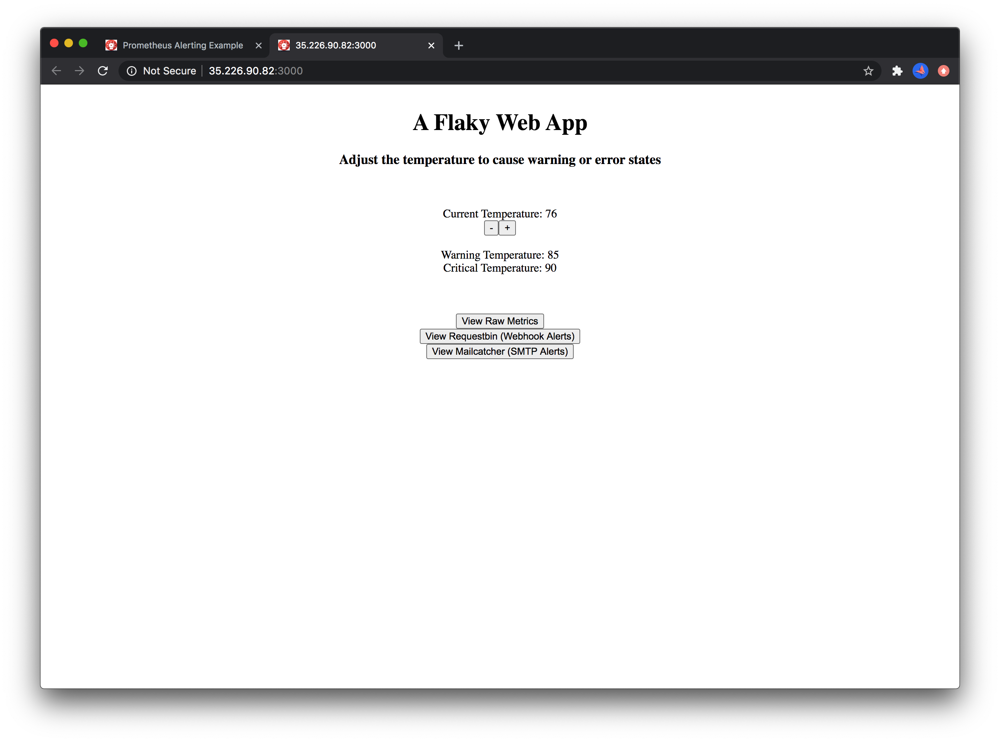
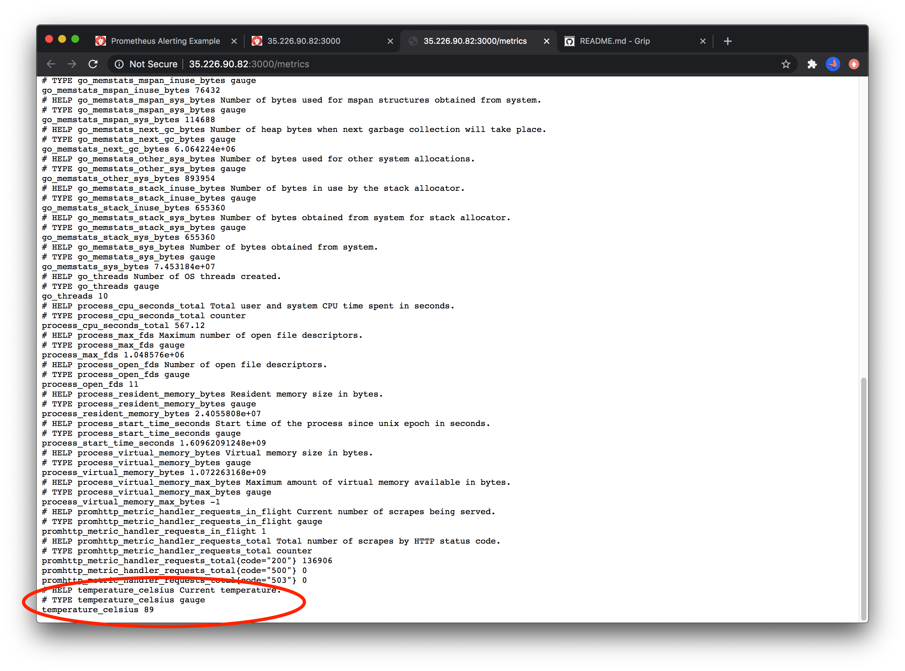
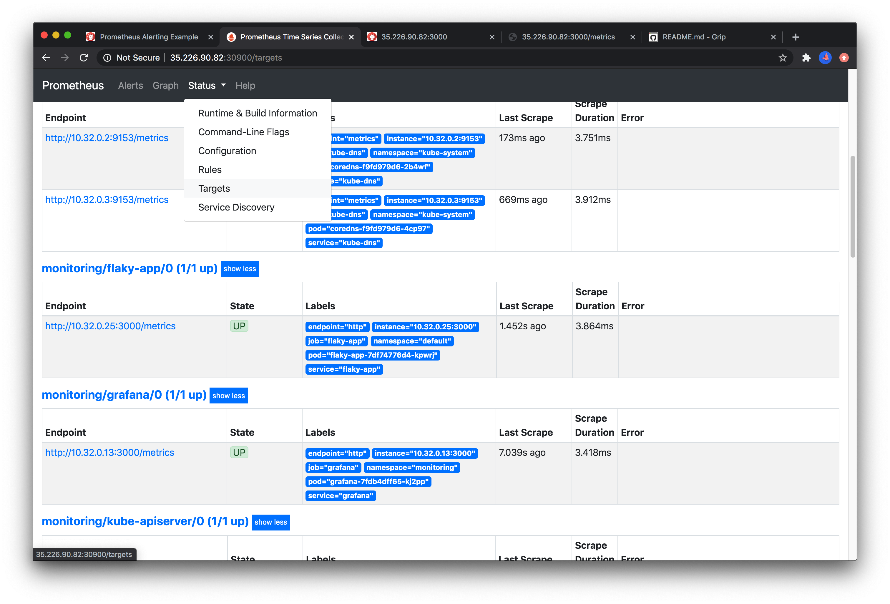
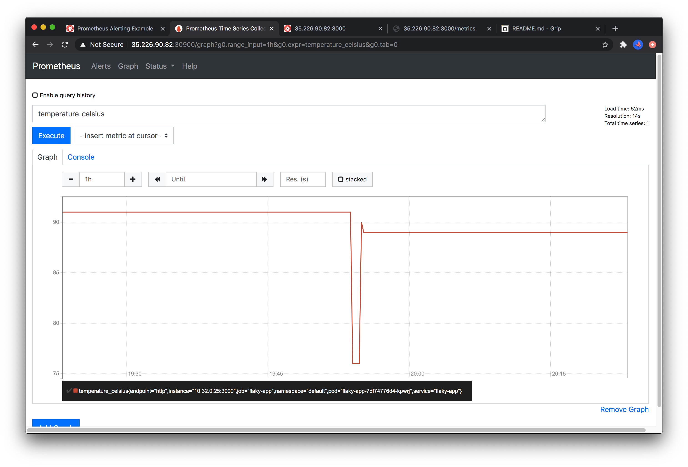
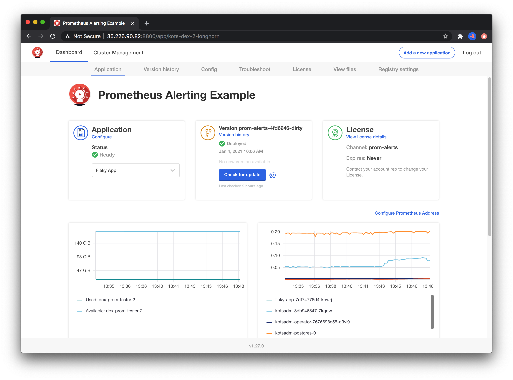

End to End Prometheus Alerting Example
===========

This example demonstrates how to use several KOTS features together with the bundled [kube-prometheus](https://github.com/prometheus-operator/kube-prometheus) stack that comes with [kurl.sh](https://kurl.sh) to configure application-level alerting via webhooks or SMTP emails.


### The Flaky App

In this example, we'll monitor a flaky app called `flaky-app`. Most notably, this app has a indicator `temperature_celsius`. When this value is above `85`, a warning should be triggered. Above a value of `90`, a critical alert should be triggered.

The deployment and service can be found in [./manifests/flaky-app.yaml](./manifests/flaky-app.yaml). The golang source code can be found in [./cmd/flaky-app](./cmd/flaky-app). The frontend is static HTML in [bad_javascript.go](./cmd/flaky-app/bad_javascript.go) (it certainly cannot be described as good javascript by any measure). 

The applicaiton stores a single temperature value in memory and has controls and API endpoints to modify the temperature up or down.



Changing the temperature will show a visual state change in the application, and we'll explore how this affects the monitoring systems on the backend.


Most notably, the applicaiton will expose the value of this temperature at `/metrics` for prometheus to pick up



### Monitoring Metrics

Now that we have a metric we can control, it's time to wire it up to prometheus. To do this we need a [ServiceMonitor custom resource](./manifests/flaky-app-servicemonitor.yaml) for the Prometheus operator. We'll deploy this to the `monitoring` namespace so our default prometheus instance will pick it up automatically.

```shell script
apiVersion: monitoring.coreos.com/v1
kind: ServiceMonitor
metadata:
  name: flaky-app
  namespace: monitoring
  labels:
    app: flaky-app
    k8s-app: flaky-app
spec:
  namespaceSelector:
    matchNames:
      - '{{repl Namespace }}'
  selector:
    matchLabels:
      app: flaky-app
  endpoints:
    - port: http
      interval: 5s
```

When this is added to our kots manifests, we should see the prometheus configuration updated with a scrape job for this service:


When this configuration is picked up, an additional prometheus target should be available



We can now graph the value of value of `temperature_celsius` over time using the graph viewer:



Graphs in KOTS Dashboard

### Temperature Alerting

Alert Rules CR


Alerts in Prom

Alerts in 


### Configuring Alert Sinks

Webhooks and SMTP

Using RequestBin and Mailcatcher.me to preview

Config Screen

Alert Manager Secret (patch config, may not work with future versions of prometheus) -- alternative CRD method might work, but not tested


Alertmanager rendered config

Previewing alerts




